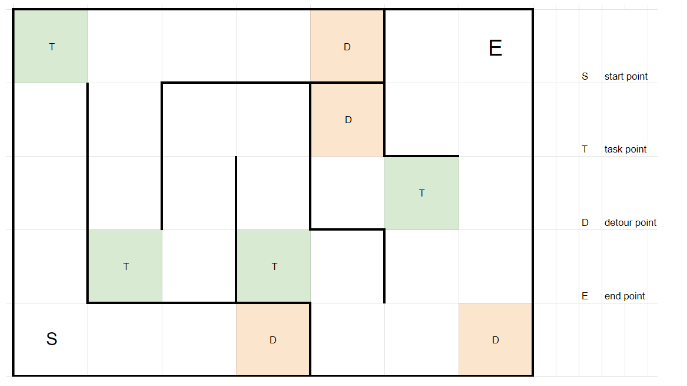
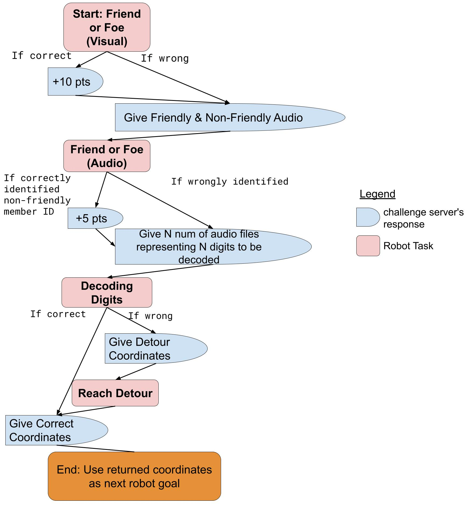

Introduction
~~~~~~~~~~~~

General Information
###################

Teams will need to program a robot to autonomously navigate through a maze and clear checkpoint tasks using AI (like Amazing Race, but for robots!). 

Robots will need to clear Tasks using 

- **Object Re-identification models** (based on the qualifiers)
- **Speech Recognition models** (also based on the qualifiers)
- **Speaker Identification models** (*new* in the Finals).

.. figure:: _static/img/finals/TIL2022_arena.jpg
    :align: center
    :width: 700px 
    
    BrainHack Today-I-Learned AI robot arena in 2022.

The robot you will use in this challenge is the `DJI Robomaster EP 
<https://www.dji.com/sg/robomaster-ep>`_. So in addition to the TIL2023 SDK that we provide, you will need to 
refer to the `DJI Robomaster SDK documentation
<https://robomaster-dev.readthedocs.io/en/latest/>`_ to program the robot to beat our challenge.

.. figure:: _static/img/finals/robomaster.jpg
    :align: center
    :width: 300px 
    
    DJI Robomaster EP Infantry Configuration

The Autonomous Robotics Challenge 
#################################

The Challenge - Autonomously Navigating and Handling Tasks
----------------------------------------------------------

Teams will need to program a robot to autonomously navigate through a maze while clearing checkpoints tasks using AI. 
The ability of the robot to clear tasks and successfully navigate the maze determines success in this challenge.
Each robot has up to 10 minutes to complete the maze.

There are two types of checkpoints in the maze; **Task Checkpoints** and **Detour Checkpoints**.

a. When your robot arrives at a **Task** checkpoint, the robot will need to complete a series of AI tasks (described below) 
   before receiving another checkpoint location to go to

b. When your robot arrives at a **Detour** checkpoint, the robot will automatically receive the coordinates of the next Task checkpoint 
   and the robot will need to navigate to that Task checkpoint

The robot is expected to clear the Task Checkpoints in a fixed order.
Eventually the robot should reach the end goal destination following the given series of checkpoints.

   Example schematic layout of the maze

Task checkpoint details - What to expect ? 
-------------------------------------------
Each Task checkpoint will contain a workflow of three AI tasks:

    a. Object Re-identification AKA "Friend or Foe (Visual)"
        i. Visually scan surroundings with robot-mounted camera
        ii. Identify if the scene contains a plushie corresponding to the 'suspect' image or 'hostage' image given to you at the start of the robot's run. 
        iii. Submit answer(“suspect”/”hostage”/None) through the scoring service API
        iv. Server will return 2 audio files (zipped in one folder) to be used in the next task, "Friend or Foe (Audio)"
    b. Speaker Identification AKA "Friend or Foe (Audio)"
        i. From the 2 audio files received from the end of "Friend or Foe (Visual)" identify which audio file belongs to which *opponent team member*
        ii. Submit the answer (in the format given - see SpeakerID)  to the scoring server 
        iii. Server will return N audio files to be used in the next task, "Decoding Digits"
    c. Automatic Speech Recognition AKA "Decoding Digits"
        i. From the N audio files received at the end of Friend or Foe (Audio), identify N digits from these audio files, in the given order. 
        ii. Submit the answer as a tuple (e.g. (1,2) ) to the scoring server 
        iii. If your submitted sequence of digits are correct, the next Task checkpoint will be given. Else the next Detour checkpoint will be given. 

   Flowchart of robot tasks at each Task checkpoint.

Things to Note
--------------

- The robot will have to communicate its findings/results to the "HQ" via the ReportingService API and it tracks its position in
  an arena through a "GPS system" AKA LocalizationService API. Please understand usage of these service APIs here: :ref:`apis`.

Differences between Novice and Advanced 
---------------------------------------

- Advanced tier will have more plushies in the scene for the ReID task
- Advanced tier will have longer passwords to decode for the Decoding Digits task
- Advanced tier will use noisier audio data in the SpeakerID task
- Advanced tier will have more checkpoints to clear

Important References
--------------------

You have the following references to aid you:

1. Robomaster SDK (See `RoboMaster APIs <https://robomaster-dev.readthedocs.io/en/latest/python_sdk/modules.html>`_)
2. Intro to the TIL-AI Reporting Service
3. Intro to the TIL-AI Localization Service
4. Provided training materials on Robotics
5. Challenge repository in which source codes for the TIL SDK, scoring server and simulator can be found

Speaker Identification 
######################

Overview
---------

The Speaker Identification component of the Finals is where teams must train a model to recognize the identity of a speaker in an audio file. The goal is to identify which audio file belongs to your own team and the opposing team.

The dataset provided includes 15s audio clips recorded during the Robotics Testing period. To evaluate the model's performance during training, 5 random clips from other teams will be given. During the "Friend or Foe (Audio)" Task, teams will 
receive two anonymous audio clips: their own team member's and their opponent's. 
Maze points will be awarded based on the model's ability to correctly **identify their opponent's** audio clip.

File Format of the Dataset (**Novice**)
---------------------------------------

For the training and evaluation dataset, audio clips will be provided in .wav format, mono, with a sampling rate of 16,000 Hz. 
The folder containing all participants' audio clips will be in the following format:

**Training Set:**

.. code-block:: none

   TeamA_Member1_train.wav
   TeamA_Member2_train.wav
   TeamB_Member1_train.wav

**Evaluation Set:**

.. code-block:: none

   TeamA_Member1_ev.wav
   TeamA_Member2_ev.wav
   TeamB_Member1_ev.wav

File Format of the Dataset (**Advanced**)
-----------------------------------------

Audio clips will be given in .wav format, *overlaid with background noises*, with a sampling rate of 16,000 Hz. The folder containing all participants' audio clips will be in the following format:

Training Set

.. code-block:: none

   TeamA_Member1_train.wav
   TeamA_Member2_train.wav
   TeamB_Member1_train.wav

Evaluation Set

.. code-block:: none

   TeamA_Member1_ev.wav
   TeamA_Member2_ev.wav
   TeamB_Member1_ev.wav

Submitting Answers For the Friend or Foe (Audio) Task
-----------------------------------------------------

During the Friend or Foe (Audio) task, teams will receive two anonymous audio files via the Reporting Service 
API: "audio1.wav" and "audio2.wav". 
One of the audio files will be a recording from a **team member**, while the other audio file will 
be a recording from a member of your **opponent team** in your *current* match-up. Teams should process these audios
through their speaker ID model, and submit their answer through the scoring server API in this format:
``{audio filename without extension}_{team name}_{member number}`` (e.g. ``"audio1_OpponentTeamName_Member1"``).

Rules
-----

- There are no restrictions on the usage of models and deep learning techniques, such as probabilistic, supervised, semi-supervised, 
  or self-supervised methods, including the loading of pretrained models.

Pre-Final Development and Testing
#################################

Simulation
----------
Teams may not have access to physical robots and arenas at all times while preparing for the competition.
Participants will be provided with a python-based software simulator and mock robot SDK which 
they can use to develop and test their robotics code. See :ref:`simulation`.

Physical
--------
Each team will be able to test their robotics code in a physical environment during the 
familiarisation period which runs from 8 Jun 2023 - 16 Jun 2023.

To ensure equal opportunity to interact with the robots, teams can book 1 *slot* in each of the following *sessions*.

- Session 1: 8th June - 9th June (**Mandatory**)
- Session 2: 12th June - 13th June
- Session 3: 14th June - 15th June

Each session has two possible slots: 

- AM slot : 9am - 12.30pm
- PM slot : 2pm - 5.30pm

Refer to :ref:`booking-info` on the booking process.

NOTE: During your team's alloted slot in Session 1 (8-9 June), teams are required to go for a recording session to record their 
voices which will form an anonymized training and finetuning dataset for the final's speaker identification and speech recognition tasks.
