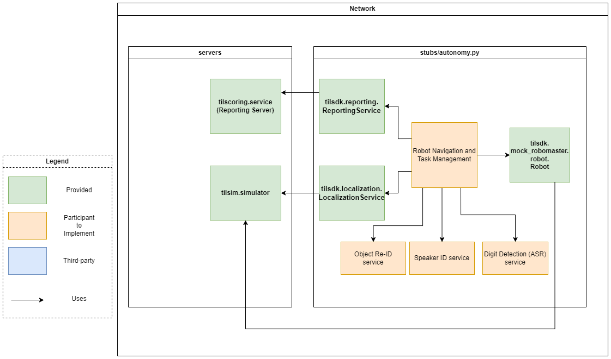
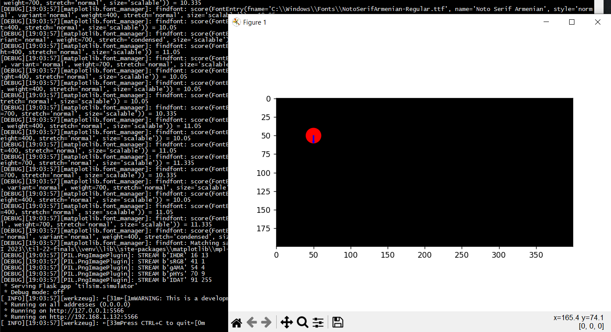

.. _simulation:

Simulation & Testing
~~~~~~~~~~~~~~~~~~~~

.. todo::
    This page is still under construction.

A basic simulator (started with the ``til-simulator`` command) is available after installing 
our provided challenge repository found at `finals challenge github repo <github.com/til-23/til-23-finals>`_.
The simulator provides a virtual arena for a virtual robot to interact with, should you not have
access to a physical robot and arena. 

You are encouraged to design various test environments and test extensively in simulation as access to
the physical arena and robots prior to the actual challenge day will be limited.

Simulation Setup
################

   System Architecture (Simulated Setup). Note that the Reporting Server 
   and Simulator can be run on the same machine as the autonomy client/code.

.. _mocks:

Virtual RoboMaster
##################

In ``tilsdk.mock_robomaster`` we provide a drop-in simulated replacement of the Robomaster SDK. 
This mock robomaster module is designed to interact with the simulated arena (til-simulator).
Use these together to test your robot's behaviour in various arena configurations.

.. tip::

    To use a mock, simply replace the import statement of the target module with 
    the equivalent mock import. For example:

    .. code:: python
        
        # Comment out the actual import
        #from robomaster.robot import Robot 

        # Replace with mock import
        from tilsdk.mock_robomaster.robot import Robot

        robot = Robot()
        robot.initialize(conn_type="ap")
        robot.set_robot_mode(mode="chassis_lead")

Note that the mock Robot does not provide or implement all the interfaces of the real robot.
We only provide some functionality to simulate robot movement through the ``chassis`` module, and
some functionality to simulate taking a picture through the ``camera`` module.

Using the Simulator
-------------------

The simulator simulates the robot movement and provides a visualization of the 
robot's behaviour within a simulated arena layout. 

In addition, the simulator exposes a simulated localization server (that mimics the interface of the real
localization server) such that your code can query it for the coordinates of the virtual robot.

The simulator accepts configuration options 
(see simulator-configuration_).

Example command to run simulator:

.. code:: shell
    
    til-simulator -c config/sim_cfg.yml

If successful, you should see something like this:

    Example of simulator server running and its visualisation.

.. NOTE::
    ``til-simulator`` sets up HTTP endpoints. When running the simulator locally
    on your development machine, your default machine configuration may prevent the
    simulator from communicating with your autonomy code.

    If you face trouble with running the simulation, check that

    1. Your loopback adpater is enabled (on Windows)
    2. Your firewall settings are not blocking traffic to the simulator.

    You can also change the host and port used by the simulator by providing it in a
    config file or via command line options (see simulator-configuration_).

Ensure that the scoring server (``til-scoring`` command) and the simulator (``til-simulator`` command) 
are running before your autonomy code attempts to connect to these services through the ReportingService API
and LocalizationService API. You will also need to make sure that you are using the ``tilsdk.mock_robomaster.robot.Robot``
class instead of the real Robomaster SDK's Robot class to control the simulated robot.

.. NOTE::

    The map images and simulator visuals are flipped in the vertical axis compared to the axes of 
    the actual arena. i.e. positive-y is down-facing in the map image files and simulator, while 
    positive-y is up-facing in the physical arena, relative to the origin (0,0).

.. _simulator-configuration:

Configuring the Simulator
-------------------------

Available command line options for the simulator can be viewed by running ``til-simulator --help``.
The simulator also accepts a YAML config file. A sample config is provided in ``config/sim_cfg.yml``.

You may use different maps with the simulator. Maps should be provided as black
and white images in PNG format. Free grid positions should be marked black and 
obstacle positions should be marked white. Be sure to specify the ``--map_scale`` used.
By default, a ``--map_scale`` of 0.01 means 1 image pixel-width corresponds to 0.01 metres in real life.

Advanced simulator usage
########################

The simulator can also be configured to provide a passthrough proxy of an *actual*
localization server. This enables you to test with the physical robot and real 
localization server while visualizing the robot on the simulation render.
