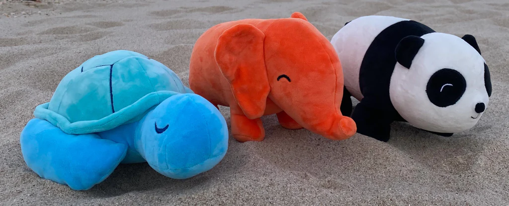

Qualifiers - OD & ReID
~~~~~~~~~~~~~~~~~~~~~~

What is the ReID Challenge about?
##################################

* The dataset consists of images of plushies. The annotations provided will be the bounding box coordinates for every plushie in the image. Refer to the annotation format for details
* Your task is to train two computer vision models.
	* You will develop an object detection model that identifies all plushies in the scene and to use relevant methods to extract these plushies into individual crops to be fed to the ReID.
	* The second model will identify whether a query plushie crop matches a target plushie crop, ie, are both plushies in the different scenes the same one.
* You will be provided a training set for your use. You are allowed to include additional data to train your model, terms & conditions apply (refer to “Important rules for participants” below for more information).
* A separate test dataset will be released and you are supposed to evaluate your model using this test dataset which **will** be used as a judging criteria for the qualifiers.
        

Example image and annotation
#############################

    
.txt

toy1_ID norm_center_x norm_center_y norm_width norm_height

toy2_ID norm_center_x norm_center_y norm_width norm_height

…

Annotations will be provided in yolo format. Refer `here <https://blog.paperspace.com/train-yolov5-custom-data/#convert-the-annotations-into-the-yolo-v5-format>`_ for more details:

.. figure:: _static/img/yolo_format_annotation.png
    :align: center
    :width: 300px 
    
    Yolo annotation format

Folder structure
################

* Images
	* plushie0001.png
	* plushie0002.png
	* plushie0003.png
	
	
* Labels
	* plushie001.txt
	* plushie002.txt
	* plushie003.txt
	
Skeleton Code
#############

* A skeleton code will be given to you, along with the training materials provided.

Evaluation - How will the ReID Challenge be evaluated?
######################################################

* The challenge will be evaluated using mAP (`mean average precision <https://www.v7labs.com/blog/mean-average-precision>`_) with IOU\@0.5, . There will only be two classes - suspect and non suspect. A plushie is classified as a suspect if it matches the query plushie. In the example below, the red elephant is the query. Your object detection model should detect all three plushies and classify the elephant as a suspect (green) and the other plushies as a non suspect (red).
        
        .. image:: _static/img/reid_task.png
            :align: center
            :width: 300px

* Note that the test plushies will be completely unseen to your model, ie, they are different to the plushies from the training dataset.

Additional rules for participants
#################################

* You need not necessarily use the boilerplate code and can write your own model code for the competition. Any form of deep learning techniques are fine i.e supervised, semi-supervised or self-supervised method, including loading of pretraining models.
* For avoidance of doubt, you may not annotate the images of the test set.