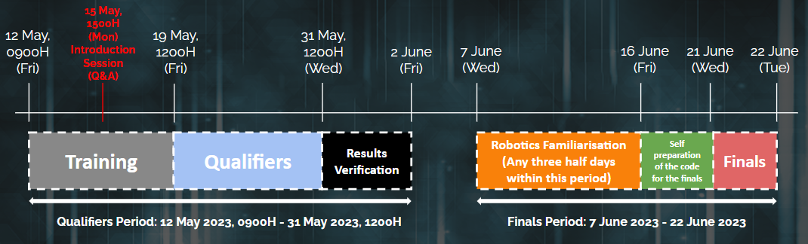

Welcome
~~~~~~~

Welcome to Today-I-Learned AI 2023, an AI and Robotics hackathon!

Whether you are learning Artificial Intelligence for the first time or already have some experience in AI development,
we are thrilled to have you join us in this exciting event.

Participants can look forward to a comprehensive hands-on learning experience covering various AI models as well as 
basic autonomous robotics.

The competition runs in two phases, Qualifiers and Finals. The best-performing teams will qualify to 
participate in the Finals stage of the competition, and have the opportunity
to experience robotics development and compete for attractive prizes!

Best of luck to all participants, and may the best AI win!

Timeline for Today-I-Learned AI 2023
####################################

This will be the timeline for the Today-I-Learned AI 2023 competition.

.. 
    .. list-table::
        :widths: 40 25
        :header-rows: 0
        
        * - Self-Paced Training (Virtual)
        - 11 May onwards
        * - Qualifiers (Virtual)
        - 19 - 31 May 
        * - Robotics Familiarisation (Physical)
        - 7 - 16 Jun
        * - Finals (Physical)
        - 21 - 22 Jun

    TIL2023 Timeline

Competition Tiers
#################

There are two tiers for participant teams to compete in: Novice and Advanced.

Novice Tier participants will compete separately from Advanced Tier participants.

For each tier, the rules and amount of help available to teams varies.

.. note::
    When reading the challenge descriptions, please take note of the differing provisions 
    for Novice Tier and Advanced Tier!

